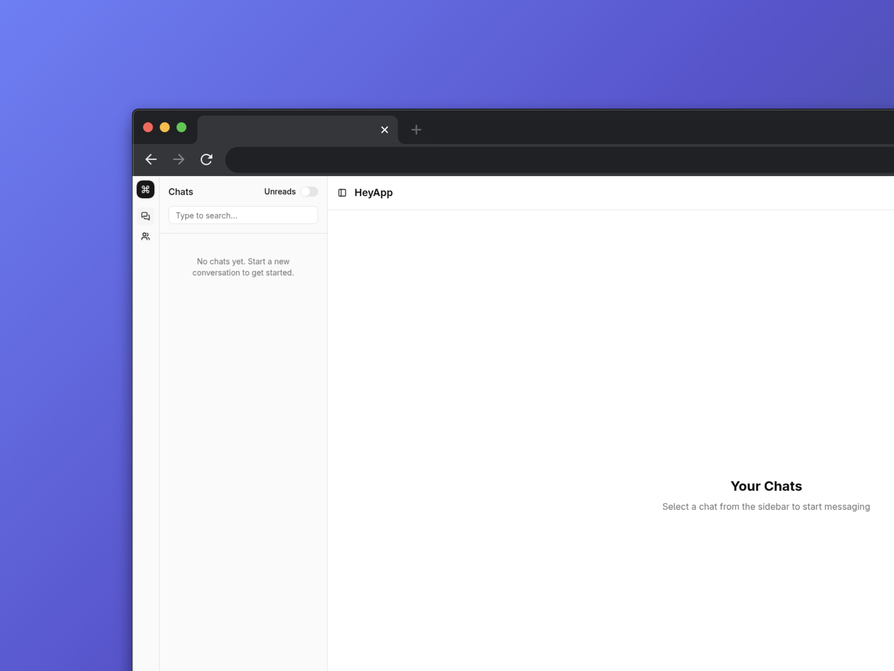
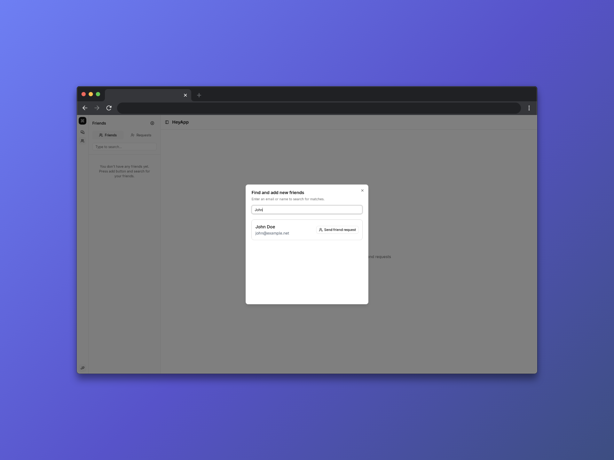
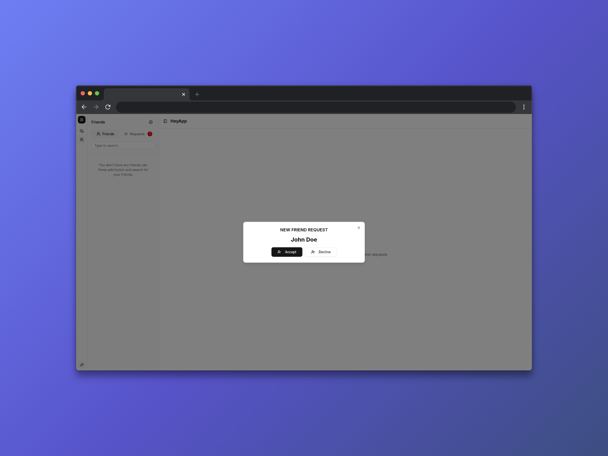
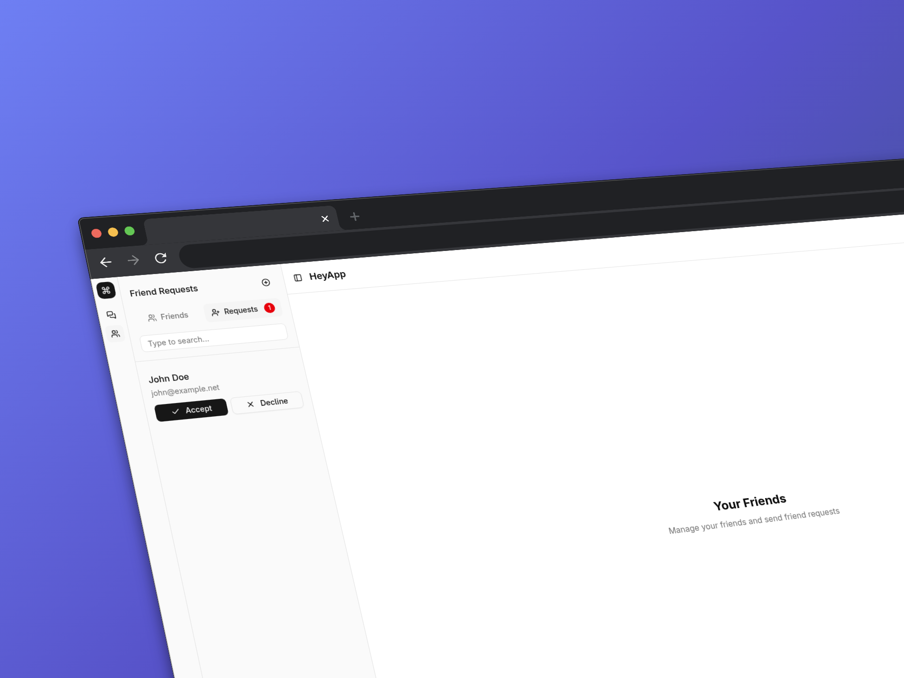
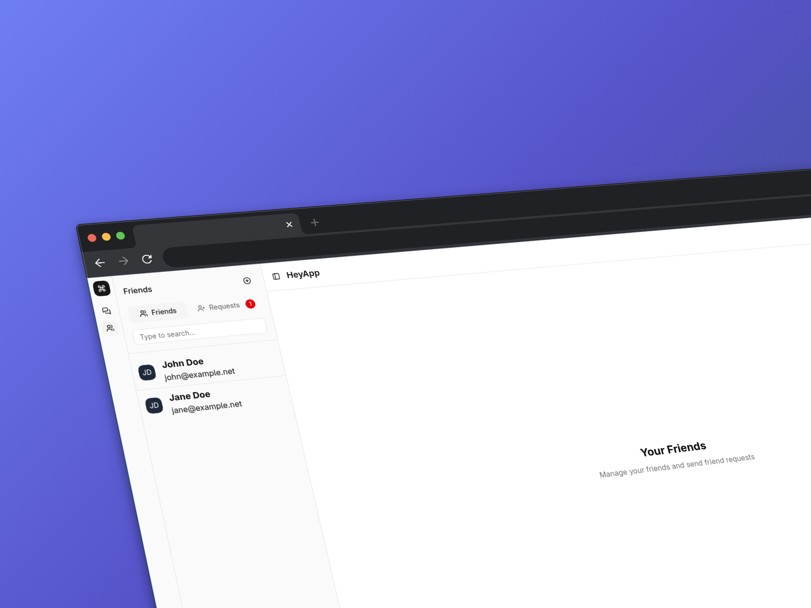
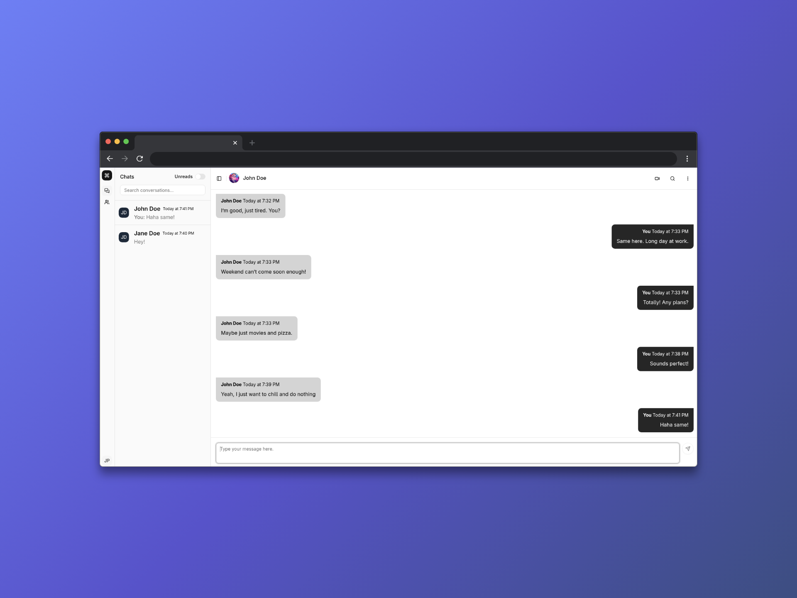
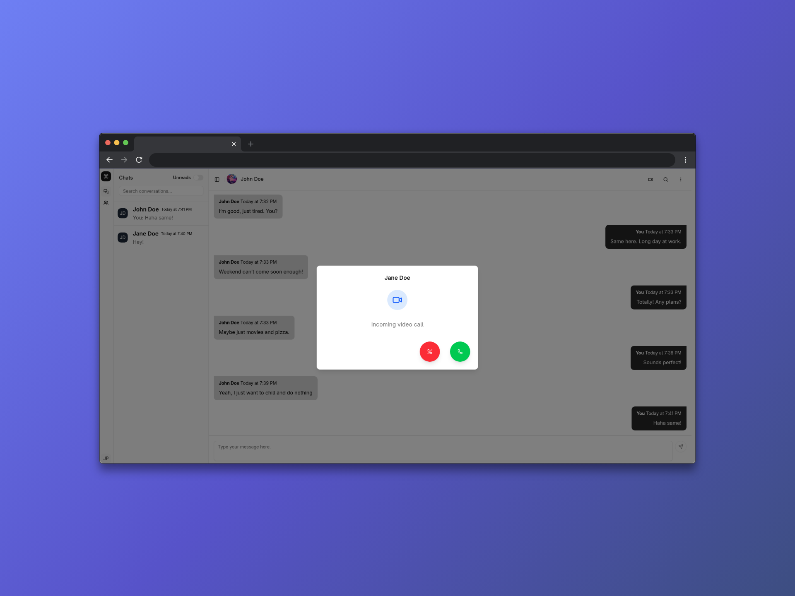
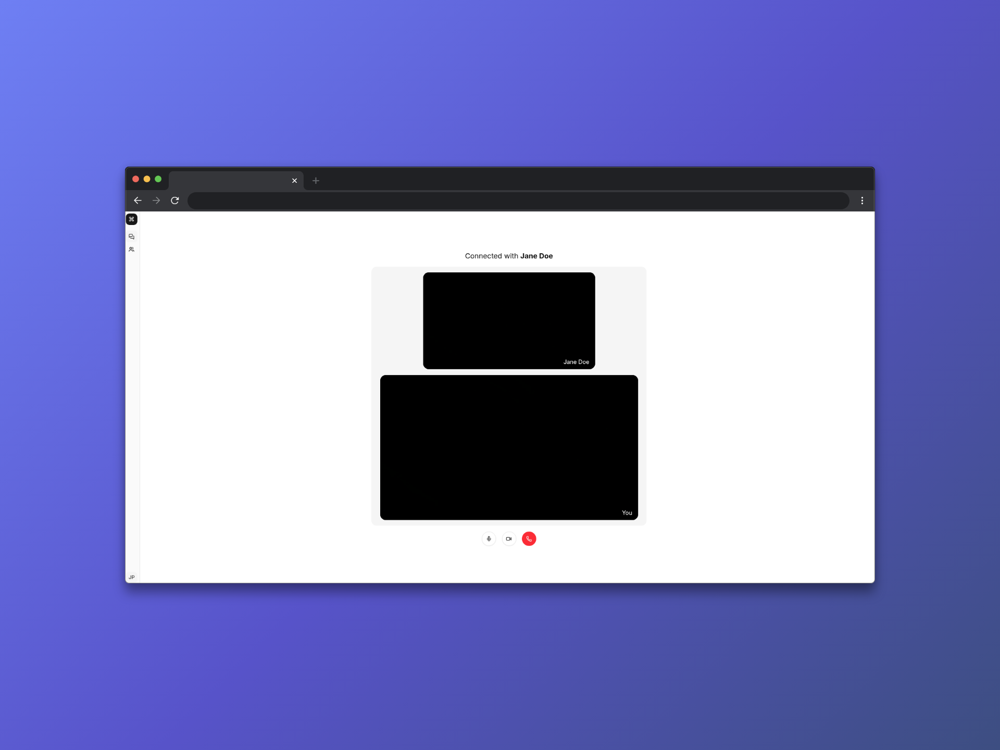
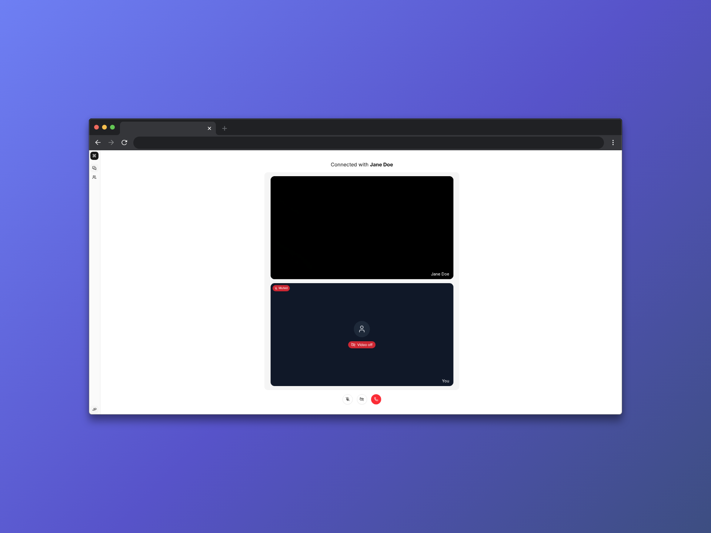

# HeyApp - Real-Time Messaging & Video Call Platform

## Description

HeyApp is a real-time messaging and video calling application built with modern web technologies. It leverages **WebSockets** for instant messaging and **WebRTC** for peer-to-peer video calls, providing users with a seamless communication experience.

### Key Features
- 👥 User authentication and registration
- 💬 Real-time messaging
- 📞 Peer-to-peer video calls
- 👫 Friend requests and friend management
- 🔄 Real-time notifications
- ⚡ Low-latency communication using WebSockets

## Table of Contents

- [Project Structure](#project-structure)
- [Technology Stack](#technology-stack)
- [Getting Started](#getting-started)
- [Architecture & Design Patterns](#architecture--design-patterns)
- [Project Motivation & Learning](#project-motivation--learning)
- [Feature Roadmap](#feature-roadmap)
- [Screenshots](#screenshots)
- [Resources & References](#resources--references)

## Project Structure

This project is organized as a **monorepo** containing both client and server applications in a single repository for simplified development and deployment.

### Folder Layout

```
heyapp/
├── apps/
│   ├── client/               # Frontend React application
│   │   ├── src/
│   │   │   ├── components/   # Reusable UI components
│   │   │   ├── pages/        # Page components (Auth, Chats, Calls, etc.)
│   │   │   ├── hooks/        # Custom React hooks
│   │   │   ├── services/     # API client services
│   │   │   ├── stores/       # State management (Zustand)
│   │   │   ├── types/        # TypeScript type definitions
│   │   │   ├── layouts/      # Layout components
│   │   │   ├── lib/          # Utility libraries and helpers
│   │   │   ├── config/       # Configuration files (WebRTC)
│   │   │   └── utils/        # General utility functions
│   │   └── public/           # Static assets
│   └── server/               # Backend Node.js application
│       ├── src/
│       │   ├── controllers/  # Request handlers
│       │   ├── handlers/     # WebSocket and event handlers
│       │   ├── routes/       # API route definitions
│       │   ├── schemas/      # Data validation schemas
│       │   ├── services/     # Business logic
│       │   ├── middlewares/  # Express middleware
│       │   ├── db/           # Database configuration and schema
│       │   └── utils/        # Utility functions
│       └── drizzle/          # Database migrations
├── docker-compose.yml        # Docker services configuration
├── pnpm-workspace.yaml       # Workspace configuration
└── package.json              # Root package configuration
```

## Technology Stack

### Database
- **PostgreSQL 17** - Primary relational database
- **Redis** - In-memory data store for caching and real-time operations

### Frontend
- **React.js v19** - UI framework
- **TypeScript** - Static type checking
- **Vite** - Fast build tool and dev server
- **Tailwind CSS** - Utility-first CSS framework
- **Zustand** - Lightweight state management
- **TanStack Query** - Server state management and synchronization
- **Socket.IO Client** - WebSocket communication

### Backend
- **Node.js** - JavaScript runtime
- **Express.js** - Web application framework
- **Drizzle ORM** - Type-safe SQL query builder
- **Socket.IO** - Real-time bidirectional communication
- **Zod** - TypeScript-first validation library

## Getting Started

### Prerequisites

Before you begin, ensure you have the following installed on your system:
- **Node.js** (v18 or higher recommended)
- **PostgreSQL 17** - Database server
- **Redis** - In-memory cache server
- **pnpm** - Fast, disk space efficient package manager

### Installation & Configuration

#### 1. Clone the repository
```bash
git clone <repository-url>
cd heyapp
```

#### 2. Install dependencies across the workspace
```bash
pnpm -r install
```
This command installs dependencies for all packages in the monorepo (client and server).

#### 3. Configure environment variables
Create `.env` files in both the client and server directories:

```bash
cp apps/server/.env.example apps/server/.env
cp apps/client/.env.example apps/client/.env
```

Then, edit each `.env` file and set the appropriate values based on your development environment:
- **Database connection** (PostgreSQL URL)
- **Redis connection** details
- **API endpoints** and other service URLs
- **WebRTC STUN/TURN server** configuration (if needed)

#### 4. Initialize the database
Once your database connection is configured, run the database migrations:

```bash
cd apps/server
pnpm drizzle-kit migrate
```

This will create all necessary tables and schemas in your PostgreSQL database.

### Running the Application

#### Development mode - All services
To start both the client and server in development mode with hot reload:

```bash
pnpm -r run dev
```

#### Development mode - Frontend only
If you only want to run the React client:

```bash
pnpm -f client run dev
```

The application will be available at `http://localhost:5173` (or the port shown in your terminal).

#### Development mode - Backend only
If you only want to run the Express server:

```bash
pnpm -f server run dev
```

### Common Tasks

#### Adding a package to the client
```bash
pnpm -f client add <package-name>
```

#### Adding a package to the server
```bash
pnpm -f server add <package-name>
```

#### Running production build
```bash
pnpm -r run build
```


## Architecture & Design Patterns

### WebRTC Perfect Negotiation Pattern

This application implements the **Perfect Negotiation** design pattern, a recommended approach for establishing WebRTC peer-to-peer connections. This pattern simplifies the connection setup by assigning roles to each peer, eliminating the complexity of collision handling.

#### How It Works

The same negotiation code runs on both peers, reducing code duplication and complexity. Each peer is assigned one of two roles:

1. **Polite Peer**: 
   - May send out connection offers
   - When a collision occurs, abandons its offer and accepts the other peer's offer instead
   - Uses ICE rollback to prevent connection conflicts
   - More forgiving in conflict resolution

2. **Impolite Peer**:
   - Always ignores incoming offers that collide with its own
   - Never backs down or compromises
   - Always wins in case of collisions
   - Simplifies decision-making

#### Role Assignment in HeyApp

In this implementation, we assign roles based on call direction:
- **Polite peer**: The user who **initiates** the call
- **Impolite peer**: The user who **receives** the call

This approach ensures predictable behavior during the negotiation process and prevents connection issues that can occur from ambiguous conflict resolution.

#### Benefits

- ✅ Single set of negotiation code for both peers
- ✅ Eliminates collision handling complexity
- ✅ Predictable error handling and state management
- ✅ More robust peer-to-peer connections

#### Learn More

For a deeper understanding of the Perfect Negotiation pattern, refer to the [MDN Web Docs on Perfect Negotiation](https://developer.mozilla.org/en-US/docs/Web/API/WebRTC_API/Perfect_negotiation).

## Project Motivation & Learning

I built HeyApp out of curiosity and a desire to deepen my understanding of real-time web technologies. I had previously worked with WebSockets and initially planned to use them exclusively for the video calling feature. However, as I designed the application, I discovered **WebRTC** — a powerful protocol for peer-to-peer communication — and learned about the **Perfect Negotiation** pattern for managing complex connection scenarios.

This project combines:
- **WebSockets** as the signaling server to coordinate peer connections
- **WebRTC** for low-latency, peer-to-peer video calls
- A monorepo structure for seamless client-server development

Through building HeyApp, I've gained practical experience with:
- Real-time communication protocols and patterns
- WebRTC peer connection negotiation
- Full-stack TypeScript development
- State management in React
- Database design and ORM usage
- Scalable application architecture

## Feature Roadmap

### ✅ Completed
- User registration and authentication
- Search and add friends functionality
- Real-time messaging
- Peer-to-peer video calls

### 🚧 In Progress / Planned
- [ ] Guided tutorial of platform usage
- [ ] End-to-end encryption (E2E)
- [ ] Group chats and group calls
- [ ] Improved responsive design for mobile devices
- [ ] Account recovery mechanism
- [ ] Sound notifications for new messages and calls
- [ ] Update personal information and user profile
- [ ] Account settings (notification preferences, blocking users)
- [ ] Block users functionality
- [ ] Search engine for conversations and messages
- [ ] Automatic session and Redis data cleanup system

## Screenshots












## Resources & References

### WebRTC & Real-Time Communication
- [MDN: WebRTC API](https://webrtc.org/)
- [Perfect Negotiation Pattern Guide](https://developer.mozilla.org/en-US/docs/Web/API/WebRTC_API/Perfect_negotiation)

### Frontend Libraries & Frameworks
- [React.js Documentation](https://react.dev/)
- [TypeScript Handbook](https://www.typescriptlang.org/docs/)
- [Vite Documentation](https://vitejs.dev/)
- [Tailwind CSS](https://tailwindcss.com/)
- [shadcn/ui - Component Library](https://ui.shadcn.com/)
- [Zustand - State Management](https://github.com/pmndrs/zustand)
- [TanStack Query - Server State Management](https://tanstack.com/query/latest)

### Backend & Database
- [Express.js Guide](https://expressjs.com/)
- [Drizzle ORM Documentation](https://orm.drizzle.team/)
- [PostgreSQL Official Documentation](https://www.postgresql.org/docs/)
- [Redis Documentation](https://redis.io/docs/)
- [Socket.IO Documentation](https://socket.io/docs/)

### Data Validation
- [Zod - TypeScript-First Validation](https://zod.dev/)

### Package Management
- [pnpm - Performant Node Package Manager](https://pnpm.io/)